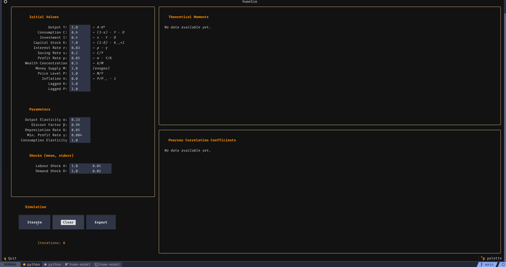

# HumeSim — Interactive Economic Simulation

**HumeSim** is a lightweight, terminal-based economic simulation model written in python. It uses the amazing [Textual](https://github.com/Textualize/textual) for a nice TUI. 

The app is built for and used in conjunction with an academic paper on David Hume and his criticism of a prevalent mercantilist economic stance during 18th century, when a feudal order was gradually replaced by nation and merchant states. The paper identifies a number of macroeconomic quantities and their functional relationships in Hume's *On Interest*, whereas the model aims to test and illustrate the trends and correlations for these variables in a dynamic simulation. 

It allows you to:
- Input initial endogenous macroeconomic variables and parameters, and exogenous demand/supply shocks.
- Manually run iterations on the model.
- Manipulate values between each iteration cycle to test various scenarios.
- View theoretical moments (mean, std. dev., variance) and Pearson correlation coefficient matrices for the variables.
- Export results to a structured CSV.

---

## Requirements

- Python3.12+
- textual (0.45.0+)
- toml


## Setup

Make sure you have Python3.12. Upgrade or install using your system’s package manager (apt, brew, etc.), or download the installer from python.org for Windows.

It's recommended to use a virtual environment (since you might have stuff installed which depends on a different version of Textual or toml):

```bash
# Create a virtual environment
python3 -m venv .venv

# Activate the virtual environment
# Linux/macOS:
source .venv/bin/activate
# Windows (CMD):
.venv\Scripts\activate.bat
# Windows (PowerShell):
.venv\Scripts\Activate.ps1

# Install required packages
pip install -r requirements.txt
```

## Running the App

After cloning the repo, run from within the repo root dir:

```bash
python -m app
```

## Configuration

Default variable values and the CSV export path are set in `config.toml`:

Example:
```toml
[defaults]
Y = 1.0       # Output
...

[parameters]
alpha = 0.33
...

[shocks]
A-mean = 1.0
...

[export]
path = "~/Documents/hume_exports/"  # relative or absolute path.
```

For Windows, an absolute path is required:
```toml
[export]
path = "C:\users\foo\bar\"  # full path
```

- The export saved as `hume_export-YYYY-MM-DD-HHMMSS.csv` inside the configured directory.
- If no path is configured, it defaults to:
  - Linux/macOS/BSD etc.: `$HOME`
  - Windows: `%USERPROFILE%`
- If the config file is otherwise faulty or missing, the simulation variable values fall back to the originally set defaults

---

## Export Format

Each export includes:

- Theoretical moments table
- Pearson correlation matrix
- Iteration snapshots (all variables over time)

---

## Development Notes

Adding or modifying equations is fairly easy. To modify one of the behavioural equations, simply find and edit the respective function in `equations.py`, e.g.:

```python
def eq_production(A: float, K: float, alpha: float) -> float:
    """Y = A * K^alpha"""
    return A * (K ** alpha)
```
...and update the corresponding line in `ui/iteration_widget.py`:
```python
Y = eq_output(A, inputs["K"], params["alpha"])
```

Depending on how the equations are modified, the order of computations might have to be adapted. In the above example, *A* must be defined or calculated earlier, and *K* is the input-field value of the current iteration.

When adding new variables for a new computation, also adapt the tuples/dicts `VARIABLES`, `VARIABLE_KEYS`, `update` and `UPDATES`. Look at the iterations module.

There are five model parameters defined in config.toml, though only two are currently used in the functional relationships. The rest are available for extensions or experimental equations.

---

Any contributions, tests or corrections welcome.

---

## 📽️ Demo


